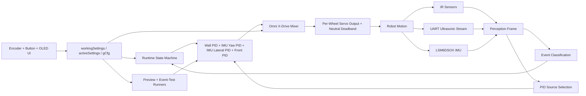
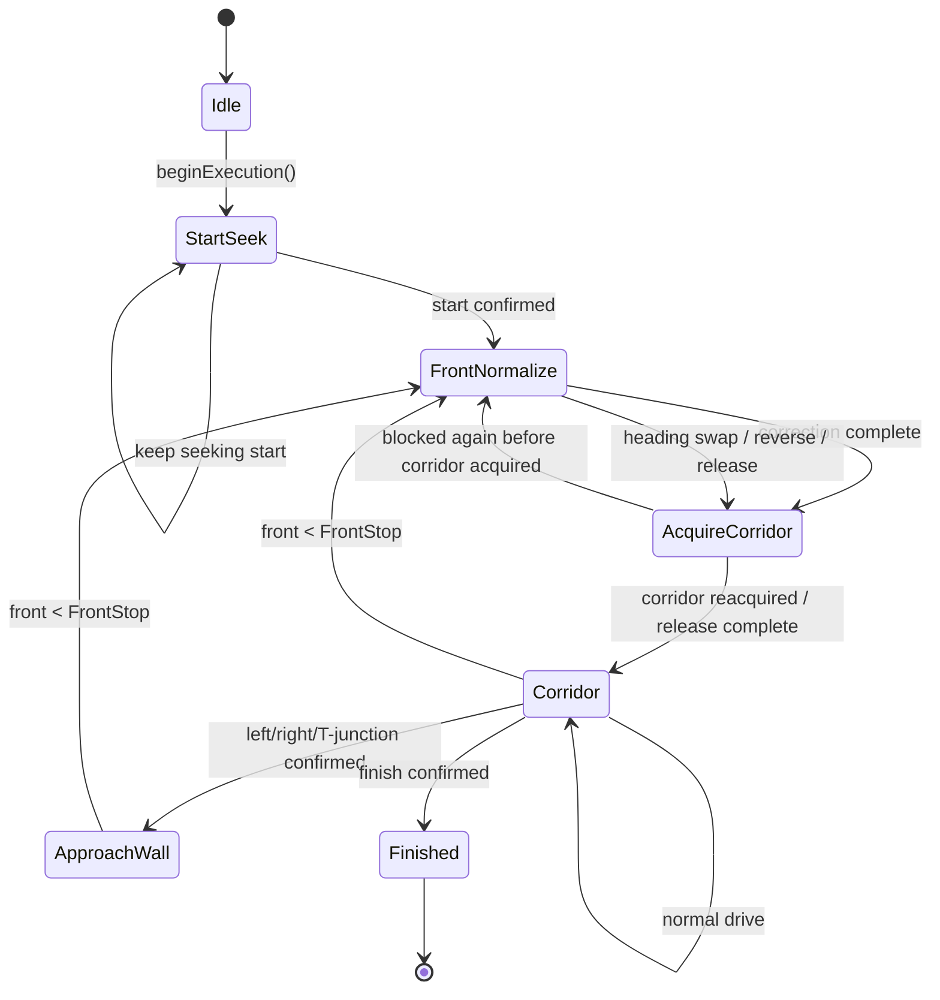
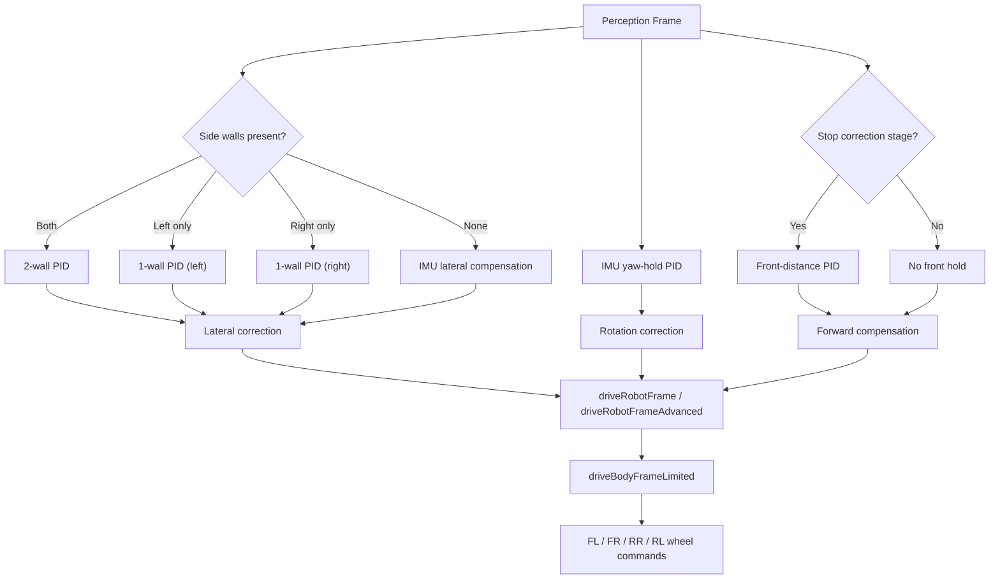
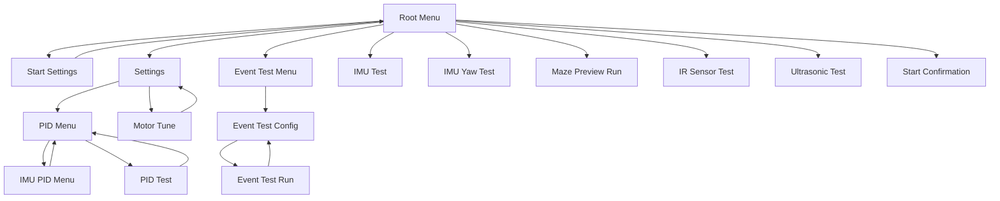
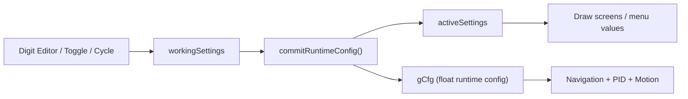
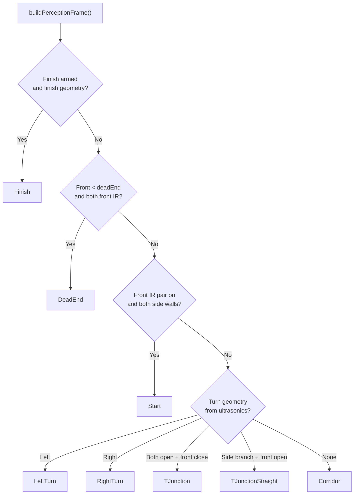

# `test_full_v67_deadend_ultra_start_2wall_zero_ramp` diagrams

## 1. System architecture

## 2. Runtime navigation flow

## 3. Control stack

## 4. Menu map

## 5. Settings data path

## 6. Event recognition overview

