# test_full_v67_deadend_ultra_start_2wall_zero_ramp Logic Block Schemes

Audience-facing PNG block schemes for the runtime logic, control loops, sensors, menu system, and planner.

## Generalised Firmware Logic

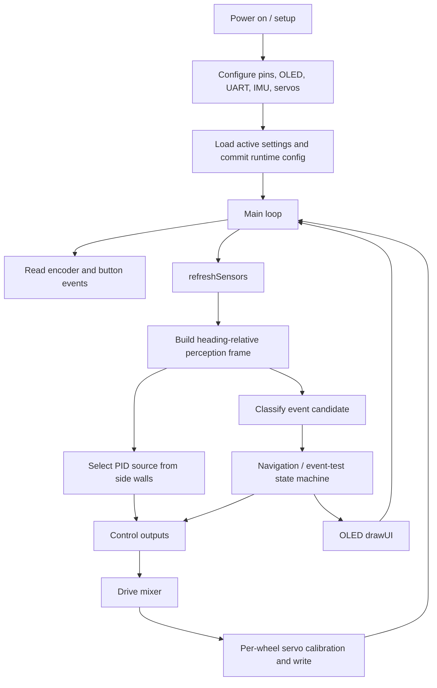

## PID Logic Selection

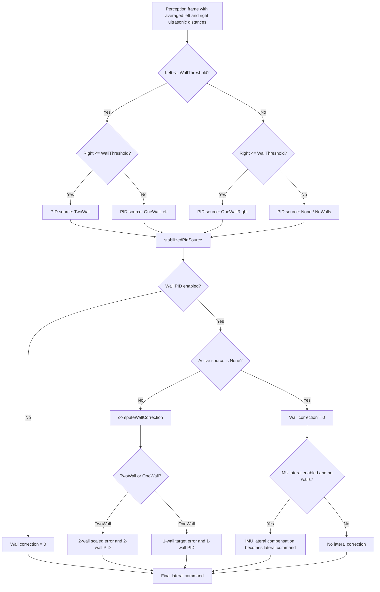

## Event Logic Selection

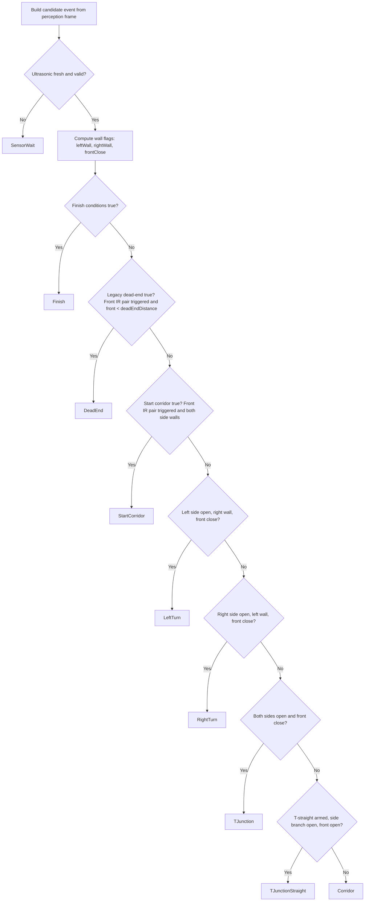

## IR Sensor Processing

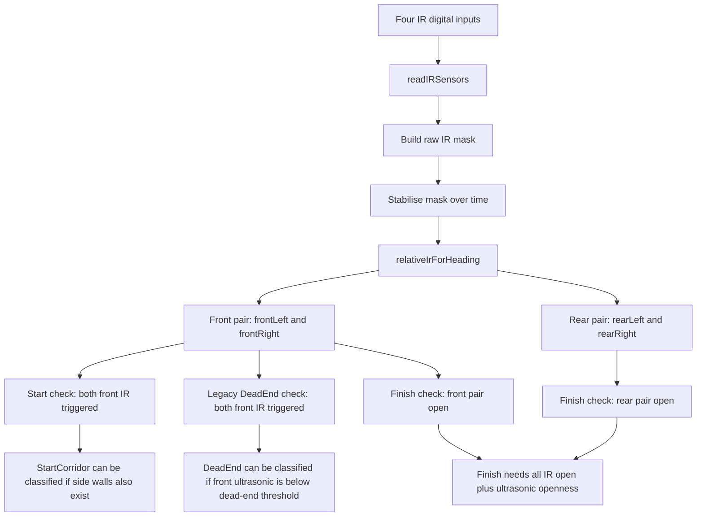

## Ultrasonic Sensor Processing

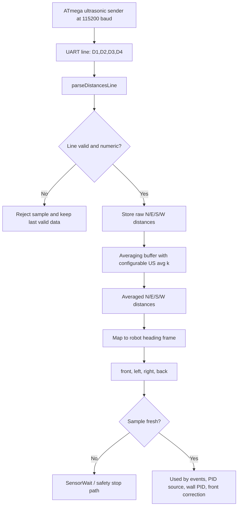

## IMU Processing

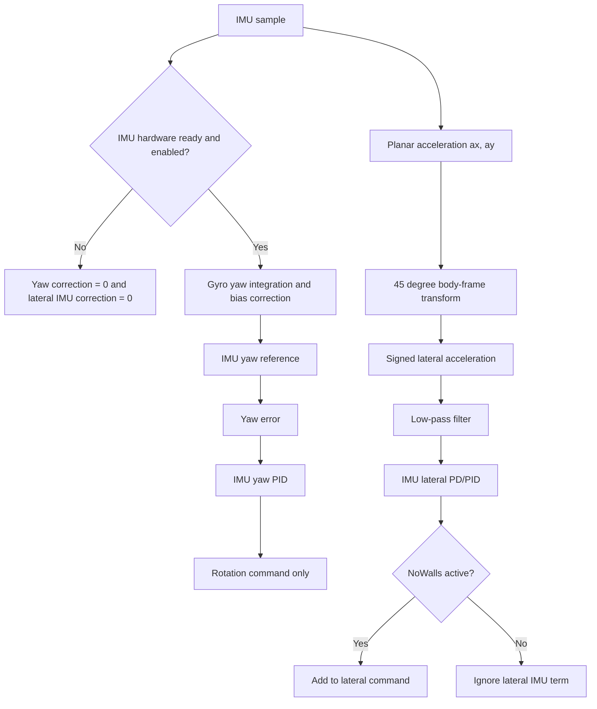

## Error Processing And Failsafes

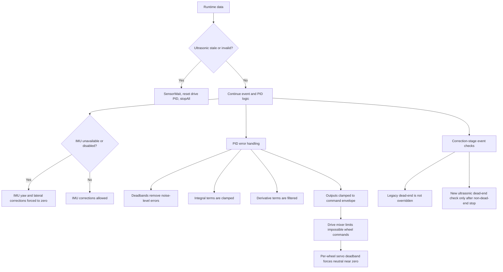

## Drive And Mixer Logic

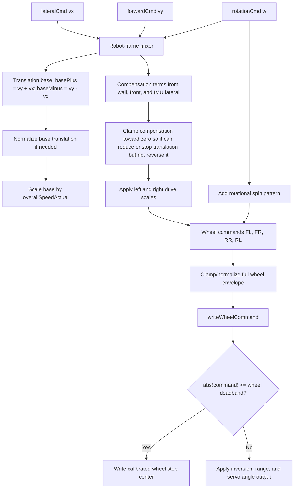

## Runtime Navigation State Machine

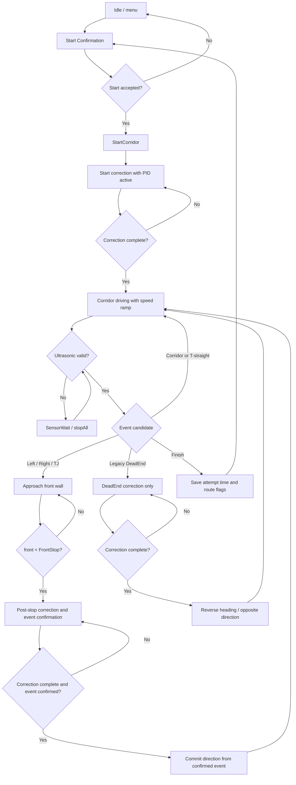

## Menu Architecture

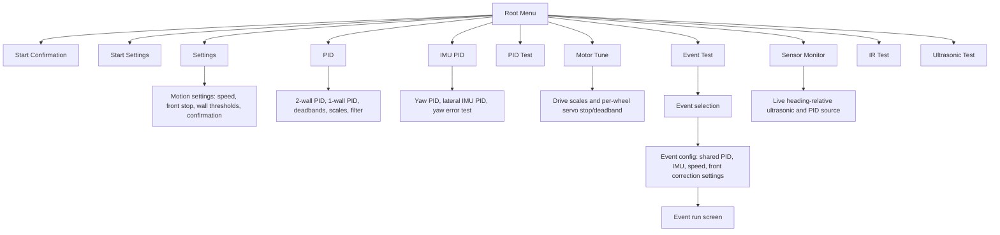

## Digital Editor Logic

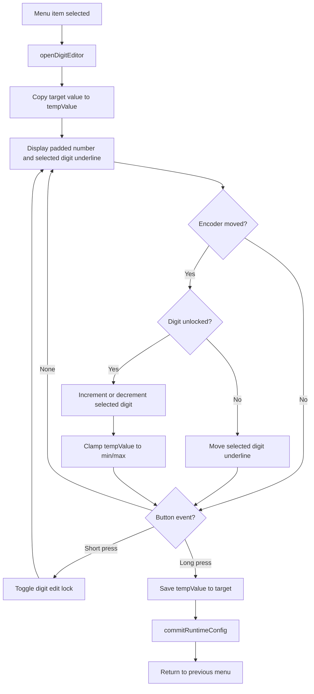

## Planner Attempt Logic

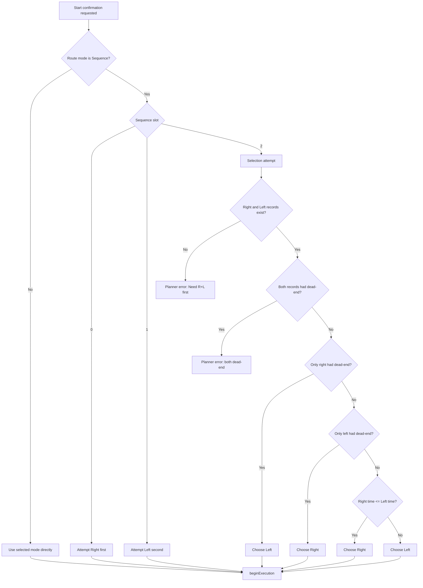

## Correction Stage Event Priority

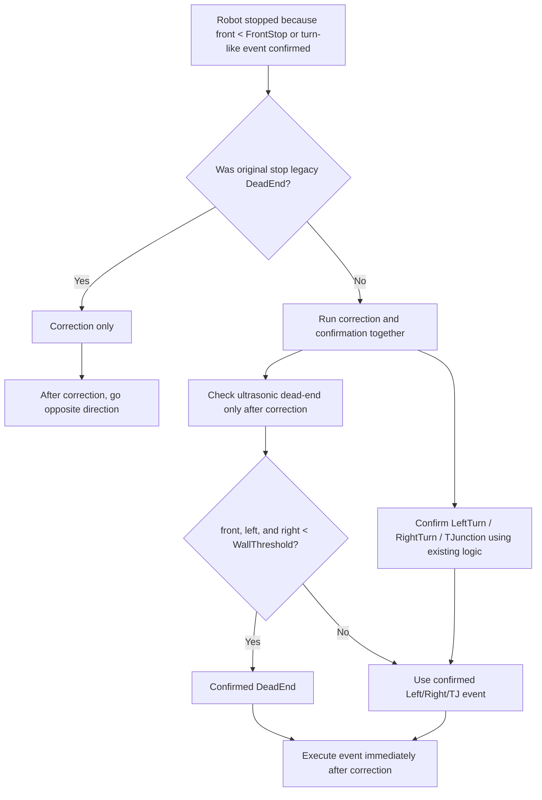
